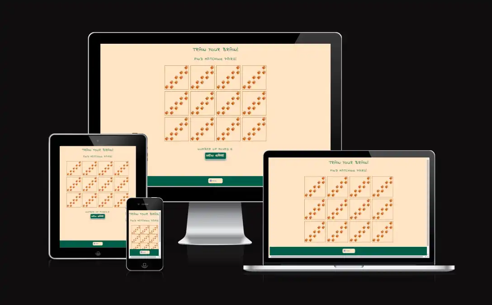
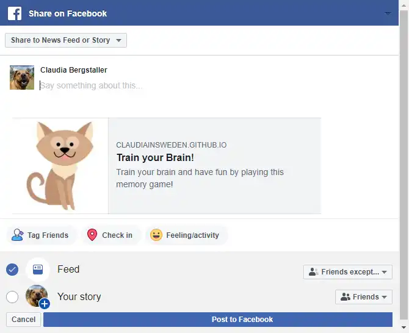
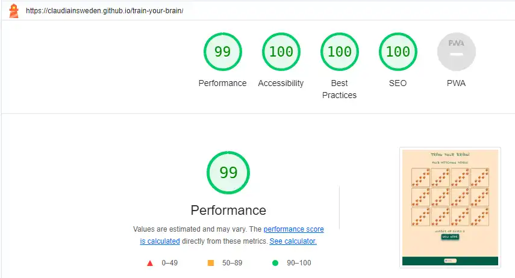

# Train your brain

## Introduction

### Project Description

[Train your brain](https://claudiainsweden.github.io/train-your-brain/) is a memory card game with 6 pairs of cards. The matching cards are to be found by flipping two cards and remember which cards are placed where to find matching pairs. When the user has found all matching pairs, the user won and can restart the game if wished.  

### Project Purpose

A memory game is a fun way to train concentration and focus and is suitable for people of all ages. 

## User stories

User story: As a user, I want to play a funny game.

End user goal: The user can play a game.

End business goal: The user plays the game.

User story: As a user, I can easily start a new game.

End user goal: User can restart the game by clicking on a restart button.

End business goal: The user plays multiple games.

User story: As a user, I want to see how many moves it took to find all matches.

End user goal: User can see how many moves it took to finalize the game.

End business goal: The user restarts the game to reach a higher score.

User story: As a user, I want to share this game to my Facebook friends.

End user goal: User can easily share the game on Facebook.

End business goal: The user shares the game to friens who share it to their friends, who in their turn share it with their friends, and so on. 

## Features

### Home

The game consists of one page only including a footer with a Facebook Share button.

### Game area

Beneath the title and welcome text the user can see a total of 12 cards with paw-prints on them.

The user starts the game by flipping the first card to see the animal on the front. When the user clicks on a second card, the cards will be compared with each other. When the cards match, that is if they show the same animal, the cards will remain flipped and stay visible to the user. If the cards don't match, the cards will be unflipped and the user may continue flipping cards to find matches.

The board will lock when two cards have been unflipped to avoid that more than 2 cards can be selected. The flipped cards will be visible for one second before they are unflipped.

Each time the user flips a card, the moves-counter under the memory game board will increase by 1.

When the user has found all 6 card pairs, an alert will pop-up with the message "Congratulations" You found all matches!". When the user clicks OK in the alert window, it will be closed and the user can start a new game by clicking the button "New Game". To avoid accidential restarts, the user will need to confirm that a new game should start. 

When the user confirms, all cards will be flipped back so that the images are no longer visible, shuffled, and the moves-counter will be reset to 0.

### Footer

The footer area contains a Share-button that opens a news feed window on Facebook, showing a preview of the game and the link to the game.

## Future Features

While the current version is fully functional, there are some ideas for future development:

- Add more cards to increase difficulty level
- Let user choose difficulty level
- Let user choose different topics for the front cards
- Add sound effect when the user wins a game
- Add possibility for the user to save the score

## Typography and color scheme

The color scheme was selected as it is calm and doesn't distract the user from the images that shall be matched. 

Typography was selected due to its playful character.

Font used: "Indie Flower" from [Google Fonts](https://fonts.google.com/).

## Technology

- IDE: Code Anywhere
- Repository: GitHub
- Image editor: SnagIt
- Image converter: [Birme](<https://www.birme.net/>)
- Favicon generator: [Favicon](https://favicon.io/)
- Image background remover: [Adobe Express](https://www.adobe.com/express/feature/image/remove-background)
  
## Testing

### Validator Testing

#### HTML

No errors were returned when passing through the [W3C Markup validator](https://validator.w3.org/).

#### CSS

No errors were found when passing through the [W3C CSS Validator](https://jigsaw.w3.org/css-validator/) validator.

#### JavaScript

No error were found when passing through [JSHint](<https://jshint.com/>) JavaScript Code Quality Tool.

#### Google Chrome Lighthouse Reports

The report presents the result of Lighthouse testing to assess the performance, accessibility, best practices and SEO of [Train your brain](https://claudiainsweden.github.io/train-your-brain/).

The tests were executed using the Google Chrome browser's DevTools.
The site scores very high in all areas.

### Manual Testing

#### Features Testing

| Feature  | Action |Result|
| ------------- | ------------- |-------------|
|Cards|
| Back card 1	  | Click  | Flips card|
| Back card 2  | Click  | Flips card |
|(assets/readme-docs/new-game-button.webp)|
|Card 1 & 2   | Match  | Both cards remain flipped |
|(assets/readme-docs/match.webp)|
|Front card 1  | Click when already matched   | Flips but unflips right after |
|Front card 2  | Click when already matched  | Flips but unflips right after |
|Card 1 & 2| No match  | Both cards unflip after one second |
|Back card 3| Click | Not possible to unflip more than two cards |
| Number of moves |  | |
| Number of moves-ccounter  | counts| Counter increments by one for each card flip|
|(assets/readme-docs/moves-counter.webp)|
| Number of moves-ccounter	| Click outside of game board |Does not increment the moves-counter |
| New Game Button	|  ||
| New Game Button	| Move mouse over button  |Changes background and font color of button|
|(assets/readme-docs/new-game-button.webp)|
| New Game Button	| Click  |Opens a confirmation alert window with the text "Are you sure you want to start a new game?"|
|(assets/readme-docs/confirmation.webp)|
| New Game Button |Click  | Changes background and font color of button|
|(assets/readme-docs/new-game-button.webp)|
| Confirmation alert  | Click on ok  | Resets and shuffles cards and moves-counter and restarts the game|
|(assets/readme-docs/reset-game.webp)|
| Confirmation alert  | Click on cancel  |Closes the alert window and leaves the game in its present state, showing matches and/or flipped cards and number of moves|
|(assets/readme-docs/card-one-flipped.webp)|
| Game won | 	| |
| All card pairs matched  | Window alert  |A window alert box appears with the text "Congratulations" ou found all matches"|
|(assets/readme-docs/congratulations.webp)|
| Window alert  | Click on OK | Window closes, game board shows all matched cards and number of moves |
|(assets/readme-docs/All-matched.webp)|
|Footer  | Click on Share |Opens a Facebook news feed window with a preview of the game and a link to it |
|(assets/readme-docs/facebook-share-small.webp)|

## Browser Testing
TO BE UPDATED

Functionality, links, layout, and responsiveness were tested with the following browsers without any issues:

- Microsoft Edge Version 117.0.2045.47
- Firefox Version 118.0.1
- Brave Version 1.58.135
- Google Chrome Version 116.0.5845.188
  
## Device Testing
TO BE UPDATED

Functionality, links, layout, and responsiveness were tested on the following devices without any issues:

- Dell Laptop 14" / 1920px x 1080px
- HP Laptop 17" / 1920px x 1080px
- Dell Screen 24" / 1920px x 1080px
- Samsung Galaxy 22S Ultra / 3088px x 1440px
- iPhone 8 / 1334px × 750px

### Findings under testing

XXX

## Deployment

The site was deployed to GitHub pages. The steps to deploy are as follows:

- In the GitHub repository, navigate to the Settings tab
- From the source section drop-down menu, select the Main Branch
- Once the main branch has been selected, the page will be automatically refreshed with a detailed ribbon display to indicate the successful deployment.
  
The live link can be found here - <https://claudiainsweden.github.io/train-your-brain//>

## Credits

### Content

Inspiration came from research on LinkedIn where former Code Institute students published their memory games from PP2 projects and because I myself like to play memory.

### Media

All images, icons and illustrations are from free sources as listed below:

- Emoji for for Favicon from [Twemoji](https://twemoji.twitter.com/)
  
  Licensing:
<https://creativecommons.org/licenses/by/4.0/>
- Favicon Converter from [Favicon](https://favicon.io/)
- Fonts from [Google Fonts](https://fonts.google.com/)
- Images converted to webp with [Birme](https://www.birme.net/)
- Images for cards from [Macrovector on Freepik](https://www.freepik.com/free-vector/wild-home-animals-set_4005528.htm)
- Paw image for back side of cards from [Vectorstock](https://www.vectorstock.com/royalty-free-vector/a-footpath-trail-dog-prints-walking-randomly-vector-33704528)
- Facebook Share Button from [Meta for Developers](https://developers.facebook.com/docs/plugins/share-button/)

### Code

The following tutorials and websites were used for inspiration and guidance:

- Memory game board: [freeCodeCamp.org](https://www.youtube.com/watch?v=ZniVgo8U7ek)
- Shuffle function: [Jonathan Zakrisson](https://jonathan97-web.github.io/Eevees-evolution/)
- Window: confirm() method: [MDN Web Docs](https://developer.mozilla.org/en-US/docs/Web/API/Window/confirm)

as well as

- [W3Schools](https://www.w3schools.com/)
- [Mdn Web Docs](<https://developer.mozilla.org/en-US/>)
- [Stack overflow](https://stackoverflow.com/)
